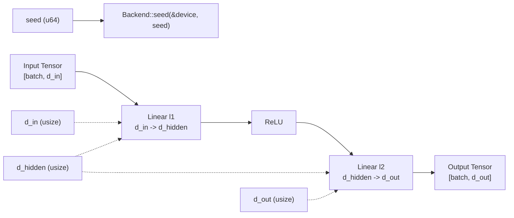

# Burn Configs + Reproducible Hyperparams

## Goal

Make experiments repeatable by:

- storing hyperparams in a `Config` struct (JSON)
- seeding the backend so randomized initialization is reproducible

## Mental Model

- A `Config` is the “source of truth” for *how to build* a model/run, not the model weights themselves.
- If initialization uses randomness (common defaults), call `Backend::seed(&device, seed)` before building to get repeatable starts.

## TinyNetConfig Graph

## Code

- `crates/burn_lab/src/bin/06_configs_repro_hparams.rs`

## How to Run

- `cargo run -p burn_lab --features burn --bin 06_configs_repro_hparams`
