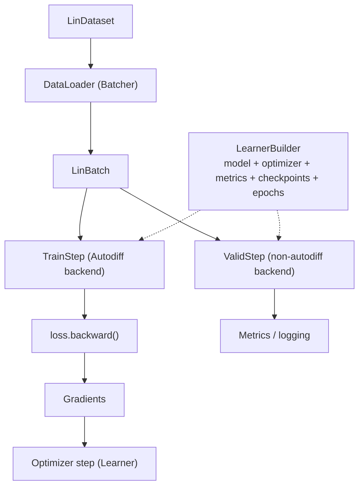
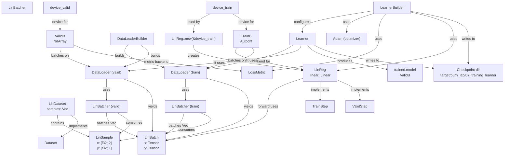

# Burn Training with `Learner` (High-Level)

## Goal

Get a working mental model for Burn’s high-level training stack:

- implement `TrainStep` / `ValidStep` on a `Module`
- wire everything together with `LearnerBuilder`
- get metrics + logs + checkpoints “for free”

## What to Look For

- `TrainStep::step` returns both:
  - gradients (from `loss.backward()`)
  - a metric-friendly output item (`RegressionOutput`), which the learner syncs off-thread
- Validation runs on the inner backend (no autodiff) via `ValidStep` on `InnerModule`
- The batcher is the DataLoader "collate" step:
  - it receives `Vec<LinSample>` and builds a single `LinBatch` of tensors
  - it flattens per-item `x`/`y` values into contiguous buffers and shapes them as
    `[batch_size, 2]` and `[batch_size, 1]` on the target device
  - this keeps the model API batched and avoids per-sample overhead in the loop

## Why Burn Calls It `Learner`

Burn's `Learner` is the high-level training driver: it wires together model + optimizer +
LR schedule + metrics + checkpoints, then runs the train/valid loop. The name
is a general ML term for a learning algorithm/agent, but it isn't universal; many
frameworks call the same role "Trainer" or "Estimator."

## Graph (High-Level Flow)

## Graph (Struct Usage + Dependencies)

## Code

- `crates/burn_lab/src/bin/07_training_learner.rs`

## How to Run

- `cargo run -p burn_lab --features burn --bin 07_training_learner`
